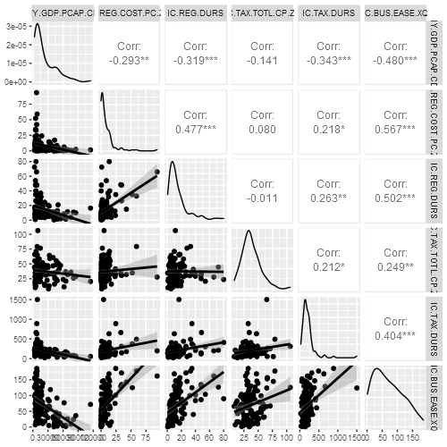

```{r setup, include=FALSE}
# Загрузка пакетов
library('dplyr')            # функции манипуляции данными  
library('data.table')       # объект "таблица данных"
library('WDI')              # загрузка данных из базы Всемирного банка
library('ggplot2')          # графическая система ggplot2
library('lattice')          # графическая система lattice
library('GGally')           # матричные графики разброса
library('knitr')            # оформление таблиц: функция kable()
library('Cairo')            # гладкая отрисовка графиков под Windows

# опции блоков кода
knitr::opts_chunk$set(echo=F)

```

# Модель по показателям развития стран  

## Загрузка данных   

Загрузим данные по странам из базы Всемирного банка. Построим для стран с высоким и средне-высоким доходом (High income & Upper middle income) модели зависимости рейтинга лёгкости ведения бизнеса (это зависимая переменная, `IC.BUS.EASE.XQ` из базы Всемирного банка) от объясняющих показателей:     

* `NY.GDP.PCAP.CD` – валовой внутренний продукт на душу населения в текущих ценах, долларов США (GDP per capita, current US$);   

* `IC.REG.COST.PC.ZS` – затраты на создание бизнеса, % от валового национального дохода на душу населения (Cost of business start-up procedures, % of GNI per capita);  

* `IC.REG.DURS` – время на создание бизнеса, дней (Time required to start a business, days);   

* `IC.TAX.TOTL.CP.ZS` – налоговая нагрузка на бизнес, % от прибыли (Total tax and contribution rate, % of profit);  

* `IC.TAX.DURS` – время на выплату налогов, часов (Time to prepare and pay taxes, hours).    

Первые строки таблицы данных за 2019 год показаны ниже.  

```{r load-data}
# список стран из справочника БД Всемирного банка
DT.country <- data.table(WDI_data$country)
DT.country <- select(DT.country, iso2c, country, region, income)

# добавляем 'Reporter.' в названия столбцов с характеристиками стран,
#  чтобы отличать продавцов от покупателя
colnames(DT.country) <- paste0('Reporter.', colnames(DT.country))

# коды и названия показателей по странам
ind.names <- c('NY.GDP.PCAP.CD', 'IC.REG.COST.PC.ZS', 
               'IC.REG.DURS', 'IC.TAX.TOTL.CP.ZS', 
               'IC.TAX.DURS', 'IC.BUS.EASE.XQ')
ind.labels <- c('ВВП на душу, текущие цены, USD',
                'Затраты на создание бизнеса, % от ВНД на душу',
                'Время на создание бизнеса, дней', 
                'Налоговая нагрузка на бизнес, % от прибыли',
                'Время на выплату налогов, часов',
                'Рейтинг лёгкости ведения бизнеса')
names(ind.labels) <- ind.names

# читаем ранее скачанные данные за 2019 год
# dest.file <- './data/wdi_2019.csv'
# fileURL <- dest.file
fileURL <- 'https://raw.githubusercontent.com/aksyuk/R_data_glimpse/main/Labs/data/wdi_2019.csv'
DT.wdi.2019 <- data.table(read.csv(fileURL, stringsAsFactors = F))

# смотрим первые строки таблицы
kable(head(DT.wdi.2019))

```

Всего в исходной таблице `r nrow(DT.wdi.2019)` строк и `r ncol(DT.wdi.2019)` столбцов. Отфильтруем данные, оставив только страны с высоким (High income) и средне-высоким (Upper middle income) уровнем дохода.  

```{r filter-data}
# фильтруем страны по регионам из варианта
DT.wdi.2019 <- filter(DT.wdi.2019, income %in% c('High income',
                                                 'Upper middle income'))

# код Намибии NA совпадает с меткой пропущенного наблюдения в R
# исправляем это
DT.wdi.2019[is.na(iso2c), iso2c := 'NA']

# убираем строки с пропусками
DT.wdi.2019 <- na.omit(DT.wdi.2019)
```

После фильтрации в таблице осталось `r nrow(DT.wdi.2019)` строк.  


## Визуализация и дескриптивный анализ   

Рассчитаем описательные статистики.   

```{r}
# описательные статистики
summary(DT.wdi.2019[, ..ind.names])
```

Рассчитаем коэффициенты вариации (значение выше 33% указывают на неоднородность показателя).  

```{r}
# коэффициенты вариации
CV <- round(sapply(DT.wdi.2019[, ..ind.names], sd) / 
                sapply(DT.wdi.2019[, ..ind.names], mean) * 100, 1)
    
df.CV <- data.frame(Показатель = ind.labels[ind.names],
                              Коэфф.вариации.прц = CV)
kable(df.CV)
```

Построим графики взаимного разброса.  

```{r, include=F}
# запись графика во внешний файл в нужном размере
Cairo('plot-01.png', width = 500, height = 500)
ggpairs(DT.wdi.2019[, ..ind.names],
        lower = list(continuous = 'smooth'))
dev.off()
```



## Линейные регрессионные модели  

Ниже показаны параметры линейной модели со всеми объясняющими переменными.  

```{r}
# модель со всеми объясняющими переменными
fit.all <- lm(IC.BUS.EASE.XQ ~ ., data = DT.wdi.2019[, ..ind.names])
# сохраняем таблицу с коэффициентами и округляем значения
tbl <- summary(fit.all)$coef
tbl[, 1] <- round(tbl[, 1], 2)
tbl[, 2] <- round(tbl[, 2], 2)
tbl[, 3] <- round(tbl[, 3], 2)
tbl[, 4] <- round(tbl[, 4], 4)
# сохраняем характеристики качества
r.sq <- round(summary(fit.all)$r.sq * 100, 1)
S <- round(summary(fit.all)$sigma, 1)
S.by.Y <- round(S / mean(DT.wdi.2019$IC.BUS.EASE.XQ) * 100, 1)
# выводим таблицу в отчёт
kable(tbl)
```

Все параметры модели значимы, поскольку P-значения (последний столбец таблицы) меньше уровня значимости (0.05). Характеристики качества этой модели:   

* Коэффициент детерминации – $R^2 = `r r.sq`$%;  

* Стандартная ошибка модели – $S = `r S`$, что составляет `r S.by.Y`% от среднего значения зависимой переменной.    

