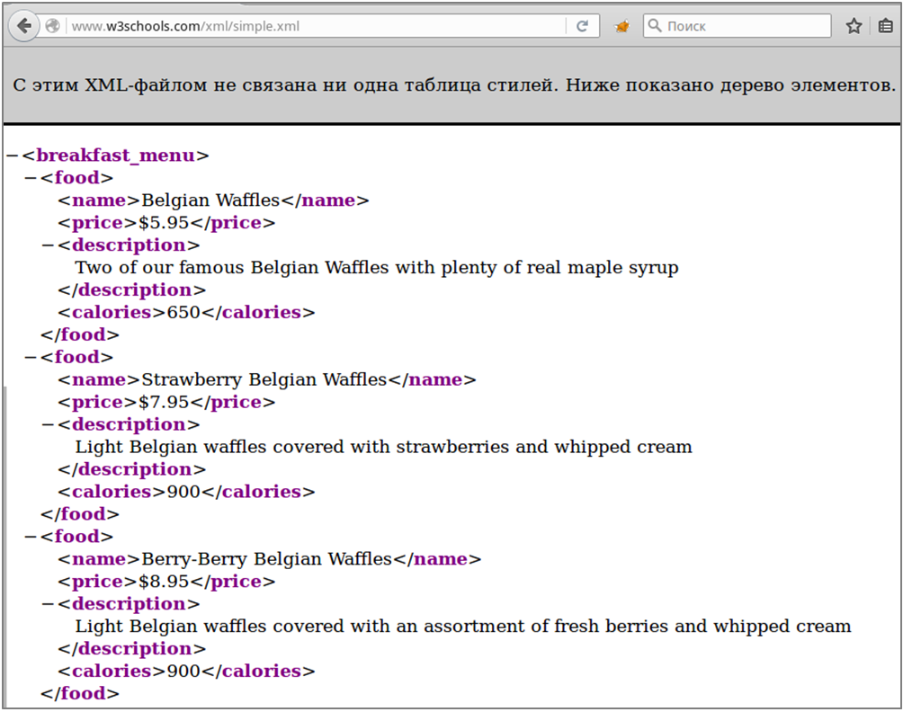
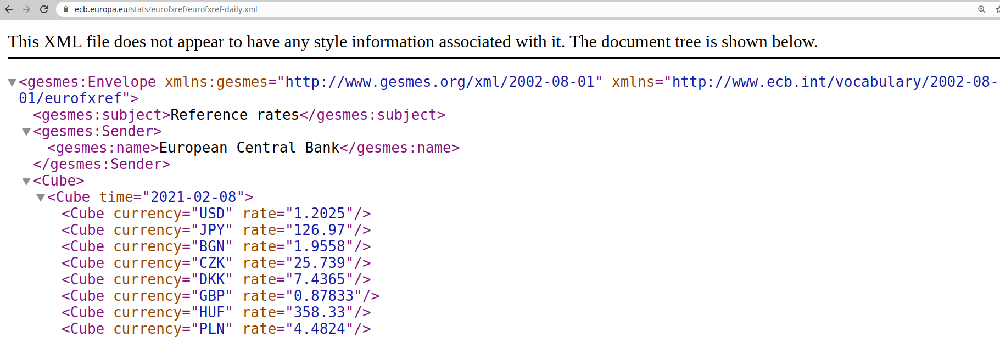
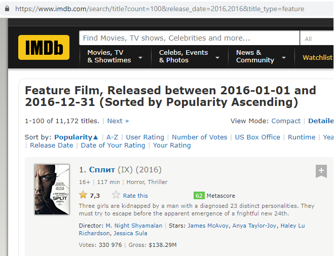
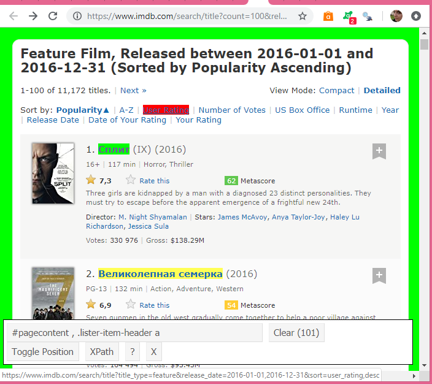

Ключевые слова: R[^1], r-project, RStudio  

Примеры выполнены R версии `r paste0(R.version$major, '.', R.version$minor)`, «`r R.version$nickname`».  

Версия RStudio: 1.4.1717.  

Все ссылки действительны на 8 февраля 2021 г.  

Репозиторий с материалами к курсу: [github.com/aksyuk/R_data_glimpse](https://github.com/aksyuk/R_data_glimpse)   

Файл с макетом кода для этой практики: `.Labs/lab-01_before.R`    

```{r setup, include=FALSE}
knitr::opts_chunk$set(
    echo = TRUE,
    comment = "#>",
    collapse = TRUE
)

# функция для форматирования чисел в тексте (2 знака после запятой)
comma <- function(x) {
    format(x, nsmall = 2, digits = 2, big.mark = ' ', decimal.mark = ',')
}
```

##### Новая страница    


# Лабораторная работа №1: загрузка данных из .csv и с помощью API сайтов   


## Несколько полезных привычек       

\ \ \ \ \ В любой работе есть важные вещи, которые быстро становятся рутиной. В аналитике это работа с данными на начальном этапе, ещё до того, как нам представится случай проявить своё творческое начало в визуализации переменных и в интерпретации того, что мы видим. Часто загрузка данных -- это рутина, но если к этому этапу отнестить неаккуратно, в ходе анализа можно создать себе неприятные проблемы. Поэтому специалисту по работе с данными лучше сразу формировать у себя полезные привычки, которые, к слову, пригодятся не только в R. 

\ \ \ \ \ Одно из преимуществ R как языка обработки данных -- воспроизводимость результатов. Технически, если код описывает всё, что происходит на разных стадиях исследования, от их загрузки до генерации отчёта, то любой пользователь может выполнить его на своём компьютере и получить такой же отчёт. Разумеется, для этого необходимо выполнение ряда условий, в частности, инструкции должны быть универсальными, а источники данных и пакеты, использованные для их обработки, -- открытыми. В этой практике мы рассмотрим несколько вариантов загрузки данных из открытых источников. При этом будем придерживаться нескольких простых правил, которые помогают избежать многих проблем.  

\ \ \ \ \ *Не задавайте явно рабочую директорию*. Пока код не является самодостаточным пакетом или отдельным приложением, мы считаем, что он адресован пользователям, знакомым с азами R. Рабочую директорию адресат задаёт без нашего участия, и её имя и расположение, очевидно, не совпадут с нашими.  

\ \ \ \ \ Однако, *сохраняйте данные в отдельную директорию внутри рабочей*. Это поможет отделить «сырые» данные и сохранить их на случай, если не будет возможности перезагрузить файл. Далее во всех примерах данные загружаются в папку «data» внутри рабочей директории.  

\ \ \ \ \ *Сохраняйте время и дату загрузки*. Это облегчает контроль версий и просто даёт представление о том, как давно всё произошло. Далее в примерах эта информация сохраняется в текстовом файле внутри директории «data».  

\ \ \ \ \ *Снабжайте данные описанием*. Обычно после предварительной обработки, которая может включать переименование столбцов, заполнение пропусков, изменение макета таблицы, файл данных отличается от исходного. В этом случае хорошим тоном будет составить короткий справочник с описанием проделанных трансформаций и с итоговым списком переменных (столбцов), с обязательным указанием их единиц измерения. В англоязычных источниках такой справочник носит название «code book», дословно -- кодовая книга. Его назначение в том, чтобы составленная вами таблица данных не превращалась для стороннего человека в шифровку. Подобными кодовыми книгами, или справочниками, как они будут называться ниже, снабжены все встроенные в R наборы данных. Чтобы убедиться в этом, достаточно вызвать справку по файлу данных, например: `?mtcars` или `?iris`.  

\ \ \ \ \ Наработав собственный опыт, читатель, разумеется, прибавит к этому минимальному списку свои правила, которые, при должной практике, превратятся в полезные привычки. Главная цель здесь, с одной стороны, настроить рабочее окружение под себя, а с другой -- в случае совместной работы над проектом свести необходимость дополнительных разъяснений к минимуму.  


## Загрузка файла .csv из сети    

\ \ \ \ \ **Пример №1**. Первый и самый простой способ получить данные -- загрузить их в виде файла с известного адреса. Загрузим таблицу со статистикой импорта сливочного масла в РФ за 2010-2018 гг. Источник данных -- база UN COMTRADE (<http://comtrade.un.org/data/>). Данные сохранены в репозитории на github.com и доступны по ссылке: <https://raw.githubusercontent.com/aksyuk/R-data/master/COMTRADE/040510-Imp-RF-comtrade.csv>.  

\ \ \ \ \ Создадим директорию `data` внутри рабочей директории с помощью функции `dir.create()` и файл для записи лога загрузок с помощью функции `file.create()`. Чтобы не перезаписывать их при повторных прогонах кода, добавим проверку условия. При загрузке и чтении данных полезны следующие функции R:  

* `file.exists('`*путь_к_файлу*`')` возвращает `TRUE`, если указанный файл существует, и `FALSE` в противном случае;  

* `exists('`*имя_объекта*`')` возвращает `TRUE`, если указанный объект существует в рабочем пространстве R, и `FALSE` в противном случае.  

\ \ \ \ \ Проверка условия существования файла (объекта) перед загрузкой (чтением) существенно экономит время при работе с таблицами большой размерности.  

```{r paragraph-01-chunk-01}
# создаём директорию для данных, если она ещё не существует:
data.dir <- './data'
if (!file.exists(data.dir)) dir.create(data.dir)
# создаём файл с логом загрузок, если он ещё не существует:
log.filename <- './data/download.log'
if (!file.exists(log.filename)) file.create(log.filename)

```


\ \ \ \ \ На этапе непосредственной загрузки файла используем функции:  

* `download.file(*URL_файла*, *имя_файла_для_сохранения*)` загружает файл и сохраняет под указанным именем. Второй аргумент может быть именем файла, тогда он будет сохранён в рабочую директорию, а также абсолютным или относительным путём к файлу. Мы используем относительную ссылку на директорию с данными: `./data/*имя_файла*`, где точка означает «в текущей (рабочей) директории».  

* `write(*текст_для_записи*, file = *имя_файла*, append = TRUE)` записывает текст в указанный файл. Аргумент `append = TRUE` означает, что новая строка будет добавлена в конец файла.  
  
```{r paragraph-01-chunk-02}
# адрес файла
fileURL <- 'https://raw.githubusercontent.com/aksyuk/R-data/master/COMTRADE/040510-Imp-RF-comtrade.csv'
dest.file <- './data/040510-Imp-RF-comtrade.csv'
# загружаем файл, если он ещё не существует, и делаем запись о загрузке в лог:
if (!file.exists(dest.file)) {
    # загрузить файл 
    download.file(fileURL, dest.file)
    # сделать запись в лог
    write(paste('Файл', dest.file, 'загружен', Sys.time()), 
          file = log.filename, append = T)
}

```

\ \ \ \ \ Наконец, чтение данных из загруженного файла во фрейм и просмотр содержимого. Помните, что в случае если таблица содержит текстовые переменные, R автоматически сделает их факторами, присвоив каждому уникальному текстовому значению порядковый номер. Если требуется прочесть заранее неизвестную таблицу, нужно запретить такое преобразование, указав в функции `read.csv()` аргумент `stringsAsFactors = FALSE`. Буквально это будет означать: не делать из символьных столбцов факторы.  

```{r paragraph-01-chunk-03-invisible, include = F}
# читаем данные из загруженного .csv во фрейм, 
#  если он ещё не существует
if (!exists('DF.import')) {
    DF.import <- read.csv(dest.file, stringsAsFactors = F)    
}
# предварительный просмотр
dim(DF.import)     # размерность таблицы
str(DF.import)     # структура (характеристики столбцов)
head(DF.import)    # первые несколько строк таблицы
tail(DF.import)    # последние несколько строк таблицы

```

```{r paragraph-01-chunk-03-visible, eval = F}
# читаем данные из загруженного .csv во фрейм, 
#  если он ещё не существует
if (!exists('DF.import')) {
    DF.import <- read.csv(dest.file, stringsAsFactors = F)    
}
# предварительный просмотр
dim(DF.import)     # размерность таблицы
str(DF.import)     # структура (характеристики столбцов)
head(DF.import)    # первые несколько строк таблицы
tail(DF.import)    # последние несколько строк таблицы

```

\ \ \ \ \ Это простой пример, поскольку загруженная таблица уже очищена от пустых столбцов и приведена к аккуратному виду, то есть:  

* каждая строка содержит одно наблюдение;  

* каждому столбцу соответствует одна переменная;  

* каждый тип наблюдений (объектов) хранится в отдельной таблице.  

\ \ \ \ \ Это список требований к тому, что принято называть «tidy data», или дословно -- «аккуратные данные». Термин предложен Хэдли Уикхэмом в одноимённой статье в 2014 году[^1]. В дополнение к этому, по заголовкам столбцов этого файла можно понять, что за переменные в нём содержатся. Для данных уже написан справочник: <https://github.com/aksyuk/R-data/blob/master/COMTRADE/CodeBook_040510-Imp-RF-comtrade.md>.  

\ \ \ \ \ Подчеркнём, что данные примера №1 уже подверглись предварительной обработке. Мы вернёмся к этому примеру в разделе «Очистка и предобработка данных», чтобы подробно поговорить об этом.  


## Загрузка данных с помощью API  


#### Сайт статистики международной торговли [comtrade.un.org/](https://comtrade.un.org/)  

\ \ \ \ \ Некоторые сайты предоставляют разработчикам API (application programming interface) – интерфейсы программирования приложений. У R есть средства для работы с API: twitter.com (пакет «twitteR» [^6]), facebook.com («Rfacebook» [^7]), quandl.com («Quandl» [^8]), finance.yahoo.com («quantmod» [^9]) и многих других. Некоторые сайты сами выкладывают API для R.  

\ \ \ \ \ **Пример №2**. Данные из примера №1 по импорту масла в РФ можно получить двумя способами:  

* Сделав запрос к базе UN COMTRADE через форму на веб-странице:  <http://comtrade.un.org/data/>.  

* Воспользовавшись API для R, описание которого приводится по адресу: <http://comtrade.un.org/data/Doc/api/ex/r>.  

\ \ \ \ \ На странице API для R сайта UN COMTRADE приводятся коды пользовательских функций для формирования запроса и примеры использования этих функций. Как и всякий API, этот имеет свои ограничения:  

* Не более одного запроса в секунду с одного IP адреса.  

* Не более 100 запросов в час с одного IP адреса.  

* API находится в режиме разработки и может быть изменён.  

\ \ \ \ \ Используем API UN COMTRADE чтобы извлечь данные, которые лежат в основе первого примера. База данных по умолчанию выдаёт результаты в формате JSON[^10], для работы с которым из R нужна библиотека `rjson` [^11]. Для начала найдём код Российской Федерации в справочнике UN COMTRADE.  

```{r paragraph-04-chunk-01}
# библиотека для работы с JSON
library('rjson')
# адрес справочника по странам UN COMTRADE
fileURL <- "http://comtrade.un.org/data/cache/partnerAreas.json"
# загружаем данные из формата JSON
reporters <- fromJSON(file = fileURL)
is.list(reporters)

# соединяем элементы списка построчно
reporters <- t(sapply(reporters$results, rbind))
dim(reporters)

# превращаем во фрейм
reporters <- as.data.frame(reporters)
head(reporters)

# даём столбцам имена
names(reporters) <- c('State.Code', 'State.Name.En')
# находим РФ
reporters[reporters$State.Name.En == 'Russian Federation', ]

```

\ \ \ \ \ Итак, код РФ в базе: `r reporters[reporters$State.Name.En == 'Russian Federation', ][1, 1]`. У базы UN COMTRADE есть ещё одно ограничение: при выборе ежемесячных данных один запрос может охватывать максимум год. Поэтому чтобы собрать данные по месяцам с 2010 по 2018 гг., нужно сделать пять запросов. Для формирования запроса за 2010 год воспользуемся функцией get.Comtrade(), сохранённой по адресу: <https://raw.githubusercontent.com/aksyuk/R-data/master/API/comtrade_API.R>.  

```{r paragraph-04-chunk-02, cache = T}
# функция, реализующая API (источник: UN COMTRADE)
source("https://raw.githubusercontent.com/aksyuk/R-data/master/API/comtrade_API.R")
# ежемесячные данные по импорту масла в РФ за 2010 год
# 040510 – код сливочного масла по классификации HS
s1 <- get.Comtrade(r = 'all', p = "643", 
                   ps = as.character(2010), freq = "M",
                   rg = '1', cc = '040510',
                   fmt = "csv")
dim(s1$data)
is.data.frame(s1$data)

```

\ \ \ \ \ Код выше загружает в рабочее пространство R функцию get.Comtrade() с известного URL, а затем вызывает её с аргументами:
* `r` -- страны, подавшие отчёт о поставке, 'all' означает выбор всех поставщиков товара в РФ;  

* `p` -- партнёр, в данном случае Российская Федерация;  

* `ps` -- период времени, здесь 2010 год в символьком формате;  

* `freq` -- частота, в данном случае 'M' означает ежемесячные данные;  

* `rg` -- код торгового потока, здесь '1' – это импорт;  

* `cc` -- код товара по гармонизированной классификации, '040510' – сливочное масло;  

* `fmt` – формат, в котором выдаются данные, здесь – «csv».  

\ \ \ \ \ Объект `s1` хранит данные (`s1$fdata`) и результаты проверки запроса (`s1$validation`). Данные представляют собой объект типа `data.frame` с 10 строками и 35 столбцами. Стоит сразу сохранить результаты запроса на диск, чтобы обращаться к ним в любое время без ограничений, которыми обладает API.  

```{r paragraph-04-chunk-03, cache = T}
# записываем выборку за 2010 год в файл
write.csv(s1$data, './data/comtrade_2010.csv', row.names = F)

```

\ \ \ \ \ Загрузку данных за все годы можно сделать в цикле. Перебор файлов или URL -- задачи, в которых применение циклов в R оправдано.  

```{r paragraph-04-chunk-04, cache = T, eval = F}
# загрузка данных в цикле
for (i in 2011:2019) {
    # таймер для ограничения API: не более запроса в секунду
    Sys.sleep(5)
    s1 <- get.Comtrade(r = 'all', p = "643", 
                       ps = as.character(i), freq = "M",
                       rg = '1', cc = '040510',
                       fmt="csv")
    # имя файла для сохранения
    file.name <- paste('./data/comtrade_', i, '.csv', 
                       sep = '')
    # записать данные в файл
    write.csv(s1$data, file.name, row.names = F)
    # вывести сообщение в консоль
    print(paste('Данные за', i, 'год сохранены в файл', 
                file.name))
    # сделать запись в лог
    write(paste('Файл', 
                paste('comtrade_', i, '.csv', sep = ''), 
                'загружен', Sys.time()), 
          file = './data/download.log', append = T)
}

```

\ \ \ \ \ Итак, с помощью API базы данных международной торговли UN COMTRADE мы загрузили ежемесячные данные по импорту сливочного масла в РФ и сохранили их в папку «data» внутри рабочей директории в отдельных файлах для каждого года, с 2010 по 2019.  


# Дополнительная информация: парсинг данных с сайтов средствами R     


## Парсинг XML  

\ \ \ \ \ Значительная часть открытых данных в интернете содержится не в файлах .xls или .csv, а в виде таблиц на веб-страницах. Анализ текста веб-страницы с целью извлечь нужную информацию, ориентируясь по тегам разметки, носит название парсинга (от англ. parse -- разбор, структурный анализ). Легче всего понять технологию парсинга веб-страниц в R на примере разбора XML, хотя на практике сайты, написанные на чистом XML, в настоящее время редки.  

\ \ \ \ \ **Пример №4**. Рассмотрим учебную XML-страницу: <http://www.w3schools.com/xml/simple.xml> [^3]. На Рис. 1 показана структура этого файла.  



\ \ \ \ \ Для разбора XML-страниц в R служит пакет «XML»[^4].  

```{r paragraph-02-chunk-01}
# Загрузка пакетов
library('httr')                # работа с URL по https
library('RCurl')               # работа с URL по http
library('XML')                 # разбор XML-файлов

# адрес XML-страницы
fileURL <- 'https://www.w3schools.com/xml/simple.xml'

# Define certicificate file
cafile <- system.file("CurlSSL", "cacert.pem", package = "RCurl")

# Read page
doc <- GET(fileURL, config(cainfo = cafile))

# разбираем объект как XML
parsedXML <- xmlTreeParse(doc, useInternalNodes = T)

```

\ \ \ \ \ Итак, в файле содержится информация о меню завтрака, о чём говорит название корневого тега «breakfast menu». По каждой позиции меню, описанной в теге «food», есть название блюда («name»), его цена («price»), описание («description») и количество калорий («calories»). Просмотрев объект `parsedXML`, можно убедиться, что он полностью повторяет эту структуру.    

```{r paragraph-02-chunk-02}
# просмотр загруженного документа
# ВНИМАНИЕ: не повторять для больших страниц!
parsedXML

```

\ \ \ \ \ Пакет «XML» содержит функции, которые позволяют перемещаться по дереву документа и извлекать текст из тегов с определённым именем и/или атрибутами. Рассмотрим некоторые из них:  

* `xmlTreeParse(`*URL_страницы*`, useInternalNodes = T)` читает структуру XML-страницы, используя её внутреннюю разметку (`useInternalNodes = T`).  

* `xmlRoot(`*документ_XML*`)` возвращает корневую запись (тег) документа. Здесь и далее под документом понимается объект в R, который содержит структуру XML-страницы, прочитанной с помощью функции `xmlTreeParse()`.  

* `xmlName(`*элемент_дерева_XML*`)` возвращает имя тега. Аргумент -- объект типа XMLNode (XML запись).  

* `xmlValue(`*элемент_дерева_XML*`)` возвращает содержимое тега.  

```{r paragraph-02-chunk-03}
# корневой элемент XML-документа  
rootNode <- xmlRoot(parsedXML)  

# имя корневого тега  
xmlName(rootNode)  

# объект rootNode относится к специальному типу «XML запись»  
class(rootNode)  

# имена тегов, дочерних к корню (именованный вектор)  
names(rootNode)  

# первый элемент дерева (обращаемся как к элементу списка)  
rootNode[[1]]  

# первый потомок первого потомка корневого тега...  
rootNode[[1]][[1]]  

# ...и его содержимое  
xmlValue(rootNode[[1]][[1]])  
```

\ \ \ \ \ Код выше реализует своего рода «слепую навигацию» по дереву, когда мы не знаем имён нужных тегов и просто движемся от одного потомка к другому. Для поиска конкретных элементов дерева используем функции:  

* `xmlSApply(`*XML_запись*`, `*имя_функции*`)` применяет («apply») функцию ко всем элементам XML записи.  

* `xpathSApply(`*XML_запись*`, "`*условие*`", `*имя_функции*`)` применяет функцию ко всем элементам, удовлетворяющим условию.  

```{r paragraph-02-chunk-04}
# извлечь все значения из потомков в XML-записи  
values.all <- xmlSApply(rootNode, xmlValue)  

# просмотреть первые два элемента  
values.all[1:2]  

```

\ \ \ \ \ Функция `xmlSApply()` применила функцию `xmlValue()` ко всем потомкам корневого тега XML-записи и соединила значения входящих в них тегов в одну длинную строку. Затем результат был объединён в вектор, в котором столько же элементов, сколько было тегов «food» под корнем. Определённо, это неудовлетворительный результат, поскольку значения нескольких переменных образовали одно значение.
Пакет «XML» содержит функции, как `xpathSApply()`, поддерживающие XPath (XML Path Language) -- язык запросов к элементам XML-документа. Аргумент, задающий условие на отбор тегов, может использовать, в частности, такие конструкции:  

* `nodename` -- выбрать все записи (теги) с именем «nodename».  

* `/` -- выбрать запись на верхнем уровне иерархии.  

* `//` -- выбрать запись на любом уровне иерархии.  

* `.` -- выбрать текущую запись.  

* `..` -- выбрать родителя текущей записи.  

* `@` -- выбрать атрибуты.  

* `[]` -- в квадратных скобках после имени записи записываются предикаты, т.е. условия на значения.  

* `*` -- выбрать все записи документа.  

* `*@` -- выбрать все записи документа с атрибутами.  

* `node()` -- выбрать все записи всех видов[^5].   

* `text()` -- извлечь значение тега (работает при наличии нескольких пространств имён).   

* `node1/parent::node2` -- выбрать тег с именем «node2», который является родительским по отношению к тегу «node1».  

* `node1/child::node2` -- выбрать тег с именем «node2», который является потомком по отношению к тегу «node1».    

* `node1/following-sibling::node2` -- выбрать тег с именем «node2», который находится на том же уровне иерархии, что и «node1», и следует за ним.  

* `node1/preceding-sibling::node2` -- выбрать тег с именем «node2», который находится на том же уровне иерархии, что и «node1», и следует за ним [^28].   

```{r paragraph-02-chunk-05}
# вытащить содержимое тегов "name" на любом уровне
xpathSApply(rootNode, "//name", xmlValue)

# вытащить содержимое тегов "price" на любом уровне
xpathSApply(rootNode, "//price", xmlValue)

```

\ \ \ \ \ Пойти дальше, то есть превратить хорошо структурированный файл в объект `data.frame`, поможет функция `xmlToDataFrame(`*XML_запись*`)`:  

```{r paragraph-02-chunk-06}
# разобрать XML-страницу и собрать данные в таблицу
DF.food <- xmlToDataFrame(rootNode, stringsAsFactors = F)
# предварительный просмотр
dim(DF.food)     # размерность таблицы

str(DF.food)     # структура (характеристики столбцов)

```

\ \ \ \ \ Напомним, что аргумент `stringsAsFactors = F` запрещает кодировать символьные переменные в факторы. Структура документа из этого примера слишком проста, чтобы проверить работу более сложных запросов.  

\ \ \ \ \ **Пример №3**. Приведём пример использования синтаксиса XPath. Используем курсы обмена евро на другие валюты, устанавливаемые на дату, которые публикуются Европейским центральным банком на сайте <https://www.ecb.europa.eu/stats/eurofxref/eurofxref-daily.xml>. Статистика доступна в формате XML. На Рис. 2 показана структура страницы с курсами на последнюю установленную дату.



```{r paragraph-02-chunk-07}
# обменный курс евро по отношению к иностранным
#  валютам, на текущую дату
fileURL <- 'https://www.ecb.europa.eu/stats/eurofxref/eurofxref-daily.xml'
# xmlParse() не работает с https, поэтому сначала читаем страницу как текст
xmlData <- getURL(fileURL)
# и разбираем содержимое в объект doc
parsedXML <- xmlParse(xmlData, useInternalNodes = T)

# корневой элемент
rootNode <- xmlRoot(parsedXML)
# класс объекта rootNode
class(rootNode)
# имя корневого элемента
xmlName(rootNode)

```

\ \ \ \ \ Структура этого дерева XML проста, но содержит пространство имён, что может доставить сложности при разборе. Запись корневого тега как `<gesmes:Envelope>` означает, что тег называется "Envelope", но имя задано на пространстве имён "gesmes", ссылка на которое дана в шапке файла. Сами курсы записаны тегами "Cube", причём и название валюты, и обменный курс записаны в атрибутах ("currency" и "rate" соответственно). Для начала попробуем извлечь все уникальные имена тегов документа, используя XPath-запрос.  

```{r paragraph-02-chunk-08}
# вытаскиваем имена всех тегов документа (*)
#  на любом уровне иерархии (//)

tag <- xpathSApply(rootNode, "//*", xmlName)
# оставляем только уникальные
tag <- unique(tag)

# считаем их количество
length(tag)

# смотрим названия
tag

```

\ \ \ \ \ Посмотрим, как обращаться к тегу с явно заданным пространством имён.    

```{r paragraph-02-chunk-09}
# в документе есть теги с явно объявленным пространством имён (namespace) gesmes
try.tag <- xpathSApply(rootNode, "//name", xmlValue)         # пусто
try.tag
try.tag <- xpathSApply(rootNode, "//gesmes:name", xmlValue)  # тег найден
try.tag

```

\ \ \ \ \ Пространство имён в файле может быть не одно. Посмотрим все пространства документа.    

```{r paragraph-02-chunk-10}
# посмотреть пространство имён xml-документа
xmlNamespace(rootNode)

```


\ \ \ \ \ Теперь извлечём наименования валют и обменные курсы из атрибутов тегов "Cube", которые содержат атрибут "currency".  


```{r paragraph-02-chunk-11}
# информация о курсах записана в тегах Cube без явного namespace
#  поэтому используем функцию name() для поиска тега
# source: https://stackoverflow.com/questions/45634155/parse-nested-xml-with-namespaces-in-r
tag <- xpathSApply(rootNode, "//*[name()='Cube'][@currency]", xmlGetAttr, 'currency')
tag
curr.names <- unlist(tag)

# курсы обмена
tag <- xpathSApply(rootNode, "//*[name()='Cube'][@currency]", xmlGetAttr, 'rate')
tag
curr.rate <- unlist(tag)

```

\ \ \ \ \ Обязательно нужно зафиксировать дату, она записана в теге «time» тега «Cube».   

```{r paragraph-02-chunk-12}
# дата (обращаемся только к тегу Cube, в котором есть атрибут time)
tag <- xpathSApply(rootNode, "//*[name()='Cube'][@time]", xmlGetAttr, 'time')
tag

```

\ \ \ \ \ Записываем всё во фрейм.    

```{r paragraph-02-chunk-13}
# превращаем XML во фрейм
DF.EUR <- cbind(curr.names, curr.rate, tag)
colnames(DF.EUR) <- c('Валюта', 'Курс к евро', 'Дата')
# предварительный просмотр
dim(DF.EUR)     # размерность таблицы
str(DF.EUR)     # структура (характеристики столбцов)

```


## Парсинг HTML  

\ \ \ \ \ **Пример №5**. Технически разбор HTML-страниц мало чем отличается от разбора XML, поскольку здесь используются те же функции пакета XML и язык XPath. Однако извлекать данные из HTML обычно труднее из-за большого количества не относящейся к данным информации как в содержимом страницы, так и в разметке. Разберём страницу с топ-200 книг по версии BBC, размещённый на Википедии.   

\ \ \ \ \ В коде ниже есть закомментированные строки кода, которые сработают в Linux, но вызывают ошибку в Windows. Это связано с тем, что пакет `RCurl` содержит ошибки, которые на момент написания этого руководства не были исправлены. Под Windows для загрузки данных по протоколу https рекомендуется использовать пакет `httr`.   

\ \ \ \ \ Ещё одна проблема связана с распознаванием кириллицы. Кодировка не всегда интерпретируется верно, поэтому надёжнее строить запросы на отбор тегов, по возможности без использования кириллицы.   

```{r paragraph-03-chunk-01, cache = T}

# пакет, который позволяет загружать данные по протоколу https под Windows
library('httr')

# URL страницы топ-200 книг по версии BBC на Википедии
fileURL <- "https://ru.wikipedia.org/wiki/200_%D0%BB%D1%83%D1%87%D1%88%D0%B8%D1%85_%D0%BA%D0%BD%D0%B8%D0%B3_%D0%BF%D0%BE_%D0%B2%D0%B5%D1%80%D1%81%D0%B8%D0%B8_%D0%91%D0%B8-%D0%B1%D0%B8-%D1%81%D0%B8"

# загружаем текст html-страницы, явно указывая кодировку (помогает от проблем с кириллицей)
# html <- getURL(fileURL, .encoding = 'UTF-8')  # работает под Linux
html <- GET(fileURL)     # работает под Windows

# класс объекта с загруженным содержимым
class(html)

# дальше только для функции GET()
html <- content(html, 'text', encoding = 'UTF-8')
class(html)

# разбираем как html
# parsedHTML <- htmlParse(html)                      # для getURL()
parsedHTML <- htmlParse(html, useInternalNodes = T)  # для GET()

# корневой элемент
rootNode <- xmlRoot(parsedHTML)

```

\ \ \ \ \ Далее, чтобы определить, в каких тегах содержится нужная информация, необходимо изучить исходный код страницы. Браузеры «Mozilla Firefox» и «Chrome» позволяют просматривать отдельно исходный код выделенного фрагмента. Для этого нужно выделить интересующую часть текста, кликнуть на ней правой кнопкой мыши и выбрать пункт контекстного меню «Исходный код выделенного фрагмента» или «Просмотреть код». Просмотр кода страницы позволил определить, что названия книг -- это значения атрибутов «title» тегов «a», которые находятся внутри тегов «li» после заголовка (`<h2...><span...>Список</span></div>`) с текстом «Список» (Рис. 3). У нужного нам тега «span» есть атрибут «class», равный "mw-headline" -- используем это, чтобы не применять кириллицу в xpath-запросе. Чтобы вытащить нужные теги «a», необходимо найти «span» с атрибутом «class», равным "mw-headline", подняться от него к тегу «h2» на уровень вверх, затем выбрать следующий тег «div» на том же уровне, и найти всех его потомков «li/a». Причём для каждой книги есть две гиперссылки, первая для названия (`a[1]`), вторая для автора (`a[2]`).   

\ \ \ \ \ Выберем все названия и авторов, а также ссылки на статьи с описанием каждой книги, кроме тех случаев, когда такой страницы нет.    

  

```{r paragraph-03-chunk-02, cache = T}
# выбираем все наименования книг
wiki.title <- xpathSApply(rootNode, '//span[@class="mw-headline"][1]/parent::h2/following-sibling::div//li/*[1]',
                          xmlGetAttr, 'title')
# проверяем длину
length(wiki.title)

# превращаем в вектор
wiki.title[sapply(wiki.title, is.null)] <- NA
wiki.title <- unlist(wiki.title)

# просмотр первых трёх элементов вектора
wiki.title[1:3]

# исправляем кодировку
Encoding(wiki.title) <- 'UTF-8'
wiki.title[1:3]

# выбираем всех авторов книг
wiki.author <- xpathSApply(rootNode, '//span[@class="mw-headline"][1]/parent::h2/following-sibling::div//li/*[2]',
                           xmlGetAttr, 'title')
# проверяем длину
length(wiki.author)

# превращаем в вектор
wiki.author[sapply(wiki.author, is.null)] <- NA
wiki.author <- unlist(wiki.author)

# исправляем кодировку
Encoding(wiki.author) <- 'UTF-8'
wiki.author[1:3]

# выбираем все ссылки на книги
wiki.link <- xpathSApply(rootNode, '//span[@class="mw-headline"][1]/parent::h2/following-sibling::div//li/*[1]',
                         xmlGetAttr, 'href')
# проверяем длину
length(wiki.link)
# просмотр первых трёх элементов вектора
wiki.link[1:3]

# превращаем в вектор
wiki.link[sapply(wiki.link, is.null)] <- NA
wiki.link <- unlist(wiki.link)

# добавляем адрес сайта во внутренние ссылки
wiki.link[!is.na(wiki.link)] <- paste0('https://ru.wikipedia.org', 
                                       wiki.link[!is.na(wiki.link)])

# объединяем во фрейм
DF.wiki <- data.frame(Книга = wiki.title, Автор = wiki.author, Ссылка = wiki.link)

# отбрасываем полностью пустые строки
DF.wiki <- DF.wiki[rowSums(is.na(DF.wiki)) != ncol(DF.wiki), ]

# записываем в файл .csv
write.csv(DF.wiki, file = './data/DF_wiki.csv', row.names = F)
# сделать запись в лог
write(paste('Файл "DF_wiki.csv" записан', Sys.time()), 
      file = log.filename, append = T)

```

\ \ \ \ \ В этом примере мы столкнулись с неверным разбором символов кириллицы. Пакет `rvest`, предназначенный для более удобного сбора данных с html-страниц, позволяет решить проблему кодировок в большинстве случаев.      


## Веб-скраппинг с пакетом "rvest"  

\ \ \ \ \ Термин "веб-скраппинг" (Web Scraping) понемногу входит в обиход специалистов по данным, заменяя понятие "парсинг веб-страниц". Скраппинг означает именно анализ сайтов с целью сбора статистики, в то время как парсинг -- более общий процесс анализа структуры текста. Сбор данных с сайтов можно производить самыми разными способами:  

* **Ручная копипаста** -- способ медленный, но устойчивый к различным вариациям структуры сайтов. Человеку, с одной стороны, проще понять, какие сведения со страницы требуется собрать. С другой стороны, при больших объёмах работы неизбежны случайные ошибки, а производительность самая здесь низкая.  

* **Поиск по текстовым шаблонам** -- другой простойи мощный подход к извлечению информации из интернета. Применяются регулярные выражения языков программирования. Методы XPath, рассмотренные выше, как раз из этой серии.  

* **Использование API** возможно для большинства крупных платформ: Facebook, Twitter, LinkedIn и других. Минус в том, что бесплатные версии API обычно сильно ограничивают объём данных, доступных для скачивания в единицу времени.   

* **Парсинг DOM** (Document Object Model -- «объектная модель документа»). Используя браузеры, программы могут извлекать динамический контент, генерируемый на стороне клиента. Также можно анализировать веб-страницы с помощью дерева объектов DOM [^27]. В R такие возиожности реализованы в пакете `rvest`.     

\ \ \ \ \ **Пример №6**. Мы будем собирать данные о самых популярных фильмах 2016 года выпуска по версии IMDB, и для поиска нужных объектов на сайте нам понадобится свободная программа "Selector Gadget" (<https://selectorgadget.com/>), доступная в виде расширения к Chrome.  

```{r paragraph-05-chunk-01}
# загружаем пакеты
library('rvest')     # работа с DOM сайта
library('dplyr')     # инструменты трансформирования данных

# URL страницы для скраппинга
url <- 'http://www.imdb.com/search/title?count=100&release_date=2016,2016&title_type=feature'

# читаем HTML страницы
webpage <- read_html(url)

```

\ \ \ \ \ Теперь соберём со страницы следующие данные:  

* `Rank` -- Ранг фильма от 1 до 100 в списке самых популярных фильмов 2016 года выпуска.  

* `Title` -- название фильма;  

* `Description` -- описание фильма;  

* `Runtime` -- длительность фильма;  

* `Genre` -- жанр фильма; в случае если их несколько, берём первый;  

* `Metascore` -- метаоценка сайта IMDB фильма.   

\ \ \ \ \ На Рис.4 показан скриншот страницы.  

 

\ \ \ \ \ Начнём с поля `Rank`. Используем расширение "Selector Gadget", чтобы получить CSS-селектор для тега, в котором записан ранг фильма. Для этого нажмите сначала на иконку расширения справа от адресной строки браузера, а затем на ранг фильма (Рис.5). Убедитесь, что все ранги подсвечены жёлтым. В рамке внизу страницы появится искомый селектор.  

 

\ \ \ \ \ Теперь используем этот селектор для выбора всех объектов, содержащих ранги, на странице. Обратите внимание, как мы объединяем две функции в одну строку с помощью пайплайна `%>%`. Объект, который возвращает функция `html_nodes()`, подаётся на вход функции `html_text()`, а результат записывается в переменную `rank_data`.  

```{r paragraph-05-chunk-02}
# скраппим страницу по селектору и преобразуем в текст
rank_data <- webpage %>% html_nodes('.text-primary') %>% html_text

# размер вектора
length(rank_data)

# первые шесть рангов
head(rank_data) 

```

\ \ \ \ \ Для рангов предпочтителен числовой формат, поэтому преобразуем полученные данные с помощью функции `as.numeric()`.  

```{r}
# конвертируем ранги в числовые данные
rank_data <- as.numeric(rank_data)

# результат
head(rank_data)

```

\ \ \ \ \ Теперь точно так же найдём селектор для названий фильмов (Рис.6). Чтобы выбрать только названия фильмов (они подсвечены жёлтым), здесь требуется творческий подход: необходимо выбрать первый заголовок, а затем кликнуть по сортировке "A-Z", чтобы отсечь все лишние ссылки. Применим селектор `'.lister-item-header a'` для загрузки названий.  

 

```{r paragraph-05-chunk-03}
# отбор названий фильмов по селектору
title_data <- webpage %>% html_nodes('.lister-item-header a') %>% html_text

# результаты
length(title_data)
head(title_data)

```

\ \ \ \ \ Код ниже отвечает за скраппинг остальных полей, кроме сводного рейтинга (`Metascore`).   

```{r paragraph-05-chunk-04}
# описания фильмов
description_data <- webpage %>% html_nodes('.ratings-bar+ .text-muted') %>% 
  html_text()
length(description_data)
head(description_data)

# длительности фильмов
runtime_data <- webpage %>% html_nodes('.text-muted .runtime') %>% html_text
length(runtime_data)
head(runtime_data)

# жанры фильмов 
genre_data <- webpage %>% html_nodes('.genre') %>% html_text
length(genre_data)
head(genre_data)

```

\ \ \ \ \ С полем `Metascore` возникает проблема, поскольку оно есть только у 97 фильмов из 100.  

```{r paragraph-05-chunk-05}
# селектор для общего рейтинга (метарейтинга) 
metascore_data <- webpage %>% html_nodes('.ratings-metascore') %>% html_text
# предварительный результат
length(metascore_data)

```

\ \ \ \ \ Проблему решает пользовательская функция, которая работает по принципу перебора всех тегов, в которые вложен `.ratings-metascore`; анализ страницы показал, что это теги `.lister-item-content`. Функция `html_nodes()` возвращает строку нулевой длины, когда не находит искомый тег внутри заданного, и нам нужно только отловить все эти случаи и заменить их на `NA`.    

```{r paragraph-05-chunk-06}
# функция перебора тегов внутри тегов более высокого уровня
get_tags <- function(node){
  # найти все теги с метарейтингом
  raw_data <- html_nodes(node, selector) %>% html_text
  # значения нулевой длины (для фильма нет такого тега) меняем на пропуски
  data_NAs <- ifelse(length(raw_data) == 0, NA, raw_data)
}

# это глобальная переменная будет неявно передана функции get_tags()
selector <- '.ratings-metascore'
# находим все ноды (теги) верхнего уровня, с информацией о каждом фильме
doc <- html_nodes(webpage, '.lister-item-content')
# применяем к этим тегам поиск метарейтинга и ставим NA там, где тега нет
metascore_data <- sapply(doc, get_tags)
# предварительный результат
length(metascore_data)
head(metascore_data)

```

  
\ \ \ \ \ Совместим данные в один фрейм и запишем его в файл `.csv`. В следующей практике мы вернёмся к этой таблице, чтобы почистить столбцы от лишних символов.     

```{r paragraph-05-chunk-08}
# совмещаем данные в один фрейм
DF_movies_short <- data.frame(Rank = rank_data, Title = title_data, 
                              Description = description_data, 
                              Runtime = runtime_data, 
                              Genre = genre_data,  Metascore = metascore_data)
# результат
dim(DF_movies_short)
str(DF_movies_short)

# записываем в .csv
write.csv(DF_movies_short, file = './data/DF_movies_short.csv', row.names = F)
# сделать запись в лог
write(paste('Файл "DF_movies_short.csv" записан', Sys.time()), 
      file = log.filename, append = T)

```


## Загрузка данных из других форматов  


\ \ \ \ \ Не будет преувеличением сказать, что в настоящее время в R реализовано чтение данных из всех популярных форматов. Мы ограничимся рассмотренными выше примерами, однако перечислим ещё несколько форматов и названия пакетов R для их обработки.    

* Книги Ms Excel .xls, .xlsx – пакет «xlsx» [^12].  

* Электронные таблицы Open Office Calc в формате .ods – пакет «readODS» [^13].  

* Файлы данных SPSS, SAS, Octave, Minitab, Stata, Weka – пакет «foreign» [^14].  

* Базы данных MySQL – пакет «RMySQL» [^15].  

* Базы данных PostgreQL, Microsoft Access, MySQL, SQLite – пакет «RODBC» [^16].  

* База данных документов MongoDB – пакет «RMongo» [^17].  

* Shapefiles и другие форматы представления геоданных – пакеты «shapefiles» [^18], «rdgal» [^19], «rgeos» [^20], «raster» [^21].  

* Изображения в форматах .jpeg, .png, .bmp – пакеты «jpeg» [^22], «png» [^23], «readbitmap» [^24].  

* Чтение и визуализация аудио – пакеты «tuneR» [^25], «seewave» [^26].  


[^1]: R Core Team (2015). R: A language and environment for statistical computing. R Foundation for Statistical Computing, Vienna, Austria. URL <https://www.R-project.org/>  

[^2]: Hadley Wickham. Tidy data. The Journal of Statistical Software, vol. 59, 2014.  
[^3]: Jeffrey Leek. Материалы курса «Getting and Cleaning Data» Университета Джонса Хопкинса на портале coursera.org, доступные в репозитории на github.com: <https://github.com/jtleek/modules/tree/master/03_GettingData>.  

[^4]: Duncan Temple Lang and the CRAN Team (2015). XML: Tools for Parsing and Generating XML Within R and S-Plus. R package version 3.98-1.3. <https://CRAN.R-project.org/package=XML>. 

[^5]: XPath Syntax. URL: <http://www.w3schools.com/xsl/xpath_syntax.asp>.  

[^6]: Jeff Gentry (2015). twitteR: R Based Twitter Client. R package version 1.1.9. <https://CRAN.R-project.org/package=twitteR>.  

[^7]: Pablo Barbera and Michael Piccirilli (2015). Rfacebook: Access to Facebook API via R. R package version 0.6. <https://CRAN.R-project.org/package=Rfacebook>.  

[^8]: Raymond McTaggart, Gergely Daroczi and Clement Leung (2015). Quandl: API Wrapper for Quandl.com. R package version 2.7.0. <https://CRAN.R-project.org/package=Quandl>.  

[^9]: Jeffrey A. Ryan (2015). quantmod: Quantitative Financial Modelling Framework. R package version 0.4-5. <https://CRAN.R-project.org/package=quantmod>.  

[^10]: JSON (JavaScript Object Notation) – простой формат обмена данными, удобный для чтения и написания как человеком, так и компьютером.  

[^11]: Введение в JSON. URL: <http://www.json.org/json-ru.html>.  

[^12]: Adrian A. Dragulescu (2014). xlsx: Read, write, format Excel 2007 and Excel 97/2000/XP/2003 files. R package version 0.5.7. <https://CRAN.R-project.org/package=xlsx>.  

[^13]: Gerrit-Jan Schutten (2014). readODS: Read ODS files and puts them into data frames. R package version 1.4. <https://CRAN.R-project.org/package=readODS>.  

[^14]: R Core Team (2015). foreign: Read Data Stored by Minitab, S, SAS, SPSS, Stata, Systat, Weka, dBase, .... R package version 0.8-66. <https://CRAN.R-project.org/package=foreign>.  

[^15]: Jeroen Ooms, David James, Saikat DebRoy, Hadley Wickham and Jeffrey Horner (2015). RMySQL: Database Interface and 'MySQL' Driver for R. R package version 0.10.7. <https://CRAN.R-project.org/package=RMySQL>.

[^16]: Brian Ripley and Michael Lapsley (2015). RODBC: ODBC Database Access. R package version 1.3-12. <https://CRAN.R-project.org/package=RODBC>.  

[^17]: Tommy Chheng (2013). RMongo: MongoDB Client for R. R package version 0.0.25. <https://CRAN.R-project.org/package=RMongo>.  

[^18]: Ben Stabler (2013). shapefiles: Read and Write ESRI Shapefiles. R package version 0.7. <https://CRAN.R-project.org/package=shapefiles>.  

[^19]: Roger Bivand, Tim Keitt and Barry Rowlingson (2015). rgdal: Bindings for the Geospatial Data Abstraction Library. R package version 1.1-3. <https://CRAN.R-project.org/package=rgdal>.  

[^20]: Roger Bivand and Colin Rundel (2015). rgeos: Interface to Geometry Engine -- Open Source (GEOS). R package version 0.3-15. <https://CRAN.R-project.org/package=rgeos>.  

[^21]: Robert J. Hijmans (2015). raster: Geographic Data Analysis and Modeling. R package version 2.5-2. <https://CRAN.R-project.org/package=raster>.  

[^22]: Simon Urbanek (2014). jpeg: Read and write JPEG images. R package version 0.1-8. <https://CRAN.R-project.org/package=jpeg>.  

[^23]: Simon Urbanek (2013). png: Read and write PNG images. R package version 0.1-7. <https://CRAN.R-project.org/package=png>.  

[^24]: Gregory Jefferis (2014). readbitmap: Simple Unified Interface to Read Bitmap Images (BMP,JPEG,PNG). R package version 0.1-4. <https://CRAN.R-project.org/package=readbitmap>.  

[^25]: Uwe Ligges, Sebastian Krey, Olaf Mersmann, and Sarah Schnackenberg (2013). tuneR: Analysis of music. URL: <http://r-forge.r-project.org/projects/tuner/>.  

[^26]: Sueur J., Aubin T., Simonis C. (2008). Seewave: a free modular tool for sound analysis and synthesis. Bioacoustics, 18: 213-226. URL: <https://CRAN.R-project.org/package=seewave>.  

[^27]: Saurav Kaushik (MARCH 27, 2017). Beginner’s Guide on Web Scraping in R (using rvest) with hands-on example. URL: <https://www.analyticsvidhya.com/blog/2017/03/beginners-guide-on-web-scraping-in-r-using-rvest-with-hands-on-knowledge/>.    

[^28]: XSLT: Применение осей. URL: <https://xsltdev.ru/xslt/recipes/primenenie-osey/>   
