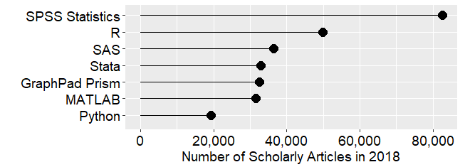

---
output:
  xaringan::moon_reader:
    css: ["./css/guu-slides-theme.css"]
    seal: false
    nature:
      ratio: '16:9'
      countIncrementalSlides: false
---

```{r setup, include=FALSE}
options(htmltools.dir.version = FALSE)

library('icons')

```

class: inverse, center, middle  
background-image: url(./images/title_GERB-GUU_16-9.png)
background-size: cover

## Обработка данных в среде офисных приложений: введение в R  

### Светлана Андреевна Суязова (Аксюк) </br> [sa_aksyuk@guu.ru](mailto:sa_aksyuk@guu.ru)  

4 сентября 2021

---

## Лекция 1

- "Введение в язык статистической обработки данных `R`"  
- три встречи, 5 пар   
- сквозное задание + тест (на последней паре)   

.pull-left[.center[

]]

.pull-right[.center[

]]

---

## R - это  

`r icons::fontawesome("rocket")` язык статистической обработки и визуализации данных

--

`r icons::fontawesome("database")` интерфейсы для чтения и сбора данных  

--

`r icons::fontawesome("box-open")` постоянно пополняемая база пакетов   

--

`r icons::fontawesome("chart-bar")` инструменты для создания отчётов, презентаций, веб-приложений (`knitr`, `shiny`, `xaringan`)  

--

`r icons::fontawesome("window-restore")` IDE на выбор: RStudio, Vim, Emacs + ESS, Jupyter Notebook, Revolution R Enterprise, etc.  

---


<font size = "4px">
Источник: <a href = "https://www.anaconda.com/state-of-data-science-2021/">Онлайн опрос на платформе Anaconda.com, апрель-май 2021 года</a>
</font>

---


<font size = "4px">
Источник: <a href = "https://www.anaconda.com/state-of-data-science-2021/">Онлайн опрос на платформе Anaconda.com, апрель-май 2021 года</a>
</font>

---

В 2018 гг. `R` на втором месте по использованию в академических исследованиях (упоминания в Google Scholar) 



<font size = "4px">
Источник: <a href = "http://r4stats.com/articles/popularity/">The Popularity of Data Science Software, r4stats.com</a>
</font>

---

## Содержание курса  

- типы и структуры данных, синтаксис, интерфейс RStudio  
- графические системы R      
- предварительный анализ данных (кросс-секционная выборка) и построение линейных регрессионных моделей   
- интерактивные отчёты на Rmarkdown, экспорт отчётов в html и word   

---

## Материалы    

- Суязова С.А. Введение в язык статистической обработки данных R: учебное пособие. ‒ М.: ГУУ, 2018. [pdf](https://github.com/aksyuk/R-Practice-basics/blob/master/RScripts/manual_basics/%D0%A1%D1%83%D1%8F%D0%B7%D0%BE%D0%B2%D0%B0%20%D0%A1.%D0%90._%D0%92%D0%B2%D0%B5%D0%B4%D0%B5%D0%BD%D0%B8%D0%B5%20%D0%B2%20R_2018_pdf_title.pdf)   

- Репозиторий со скриптами и pdf-файлами к лекциям и лабораторным: [github.com/aksyuk/R_data_glimpse](https://github.com/aksyuk/R_data_glimpse)   

- А.Б. Шипунов, Е.М. Балдин, П.А. Волкова, А.И. Коробейников, С.А. Назарова, С.В. Петров, В.Г. Суфиянов Наглядная статистика. Используем R! ‒ 2020, исправленная версия. [pdf](https://cran.r-project.org/doc/contrib/Shipunov-rbook.pdf)   

- Роберт И. Кабаков R в действии. Анализ и визуализация данных в программе R. ‒ ДМК Пресс, 2014. [pdf](https://codernet.ru/books/r/r_v_dejstvii/)   

---

## Лекция №1: основы   

Особенности работы в R:   

`r icons::fontawesome("check-square")` функции в основе всего   

--

`r icons::fontawesome("check-square")` все объекты сессии хранятся в оперативной памяти   

--

`r icons::fontawesome("check-square")` по умолчанию параллельные вычисления не поддерживаются   

--

`r icons::fontawesome("check-square")` текстовые результаты выводятся в консоль   

--

`r icons::fontawesome("check-square")` графические результаты выводятся во встроенный браузер, либо в файл    

---

### Типы переменных    

- числовой, целый: `integer`   
- числовой, с плавающей **точкой**: `double` (по умолчанию)   

.pull-left[
```{r}
typeof(42)
is.integer(42)
```
]
.pull-right[
```{r}
typeof(integer(42))
typeof(6.5)
```
]

---

### Типы переменных    

- текстовый: `character` (любые парные кавычки)  

```{r}
typeof("Введение в язык R")
typeof('Курс "Введение в язык R"')
typeof('42')
```

---

### Типы переменных    

- логический: `logical`  

`F` равносильно `FALSE`, `T` равносильно `TRUE`  

```{r}
2 == '2'
'осень' != 'лето'
```

---

### Структуры данных  

**Вектор** – одномерный набор элементов одного типа,  
нумерация элементов с единицы. Функция `c()` – от **c**oncatenate.   

.pull-left[
```{r}
x <- c(1, 1, 2, 3)
typeof(x)

y <- c(TRUE, 1, '2', "3")
typeof(y)
```
]
.pull-right[
```{r}
x == y
```
]

---

### Структуры данных  

**Матрица** – вектор с двумя измерениями.   

```{r}
x.matrix <- matrix(c(1, 2, 3, 4, 5, 6), 2, 3)

x.matrix

dim(x.matrix)
```

---

### Структуры данных  

**Список** – одномерный набор элементов, типы м.б. разными   

```{r}
my.list <- list(index.name = "ВВП РФ, трлн долл.", 
       year = 2017:2020, value = c(1.58, 1.66, 1.69, 1.48))
my.list
```

---

### Структуры данных  

**Фрейм данных** (`data.frame`) – таблица с показателями-столбцами (векторы) и наблюдениями-строками, **список векторов**.  

```{r}
df.2019 <- data.frame(city = c("Москва", "Воронеж",
                               "Липецк"),
                      popul.mln = c(12.5, 1.1, 0.6),
                      area.sq.km = c(2561.5, 596.51, 330.15))
df.2019
```

---

### Структуры данных: фрейм    

```{r}
str(df.2019)        # посмотреть структуру любого объекта  
colnames(df.2019)   # посмотреть названия столбцов фрейма
```

---

### Базовые операторы   

Присваивание справа налево:  `<-`, сочетание **Alt + "-"**  

Выбор элемента: `[]` 

Выбор элемента списка: `$`  

```{r}
df.2019$city
df.2019$city[1]
```

---

### Базовые операторы: `[]`   

```{r}
df.2019[1, ]   # выбрать первую строку фрейма 
df.2019[, 1]   # выбрать первый столбец фрейма
df.2019[1, 2]  # выбрать элемент из строки 1, столбца 2
```

---

### Базовые операторы: `[]`   

```{r}
df.2019[, 2:3] # выбрать второй и третий столбцы фрейма
df.2019[, c('popul.mln', 'area.sq.km')] #по именам столбцов
```

---

### Ключевые приёмы: векторизация   

**Векторизация** – применение функции (оператора) ко всем элементам вектора   

```{r}
# проверить, в каких городах население больше миллиона
df.2019$popul.mln > 1
# названия этих городов
df.2019$city[df.2019$popul.mln > 1]
```

---

### Ключевые приёмы: векторизация  

```{r}
x <- c(1, -2, 3, -4)
# увеличить все элементы вектора на 1
y <- x + 1
# вывести результат
y 

# увеличить только положительные элементы вектора на 2
x[x > 0] <- x[x > 0] + 2
# вывести результат
x
```

---

### Ключевые приёмы: apply-функции   

- Семейство `apply()`: применение функции к элементам списка      

```{r}
apply(df.2019[, 2:3], 2, mean) # средние насел. и площадь
sapply(df.2019[, 2:3], mean)   # применяем то же к списку
```

---

### Ключевые приёмы: apply-функции   

```{r}
lapply(df.2019, mean)
```

---

### Ключевые приёмы: вызов справки   

- **Работа с документацией**   

```{r, eval = F}
# вызов справки по функции apply 
?apply

# поиск по сайту проекта (открывается в браузере)
RSiteSearch('apply')
```

около 400 тысяч вопросов с тегом `[r]` на stackoverflow.com: [stackoverflow.com/questions/tagged/r](https://stackoverflow.com/questions/tagged/r)

---

### Распространённые ошибки

```{r, eval = F}
с(1, 2, 3, 4)  # функция с() написана по-русски
```
`Error in с(1, 2, 3, 4) : could not find function "с"`

```{r, eval = F}
sum(df.2019$city) # пытаемся посчитать что-то нечисловое
```

<p style="color:#C0392B;font-family:'Source Code Pro'">Error in sum(df.2019$city) : invalid 'type' (character) of argument</p>

```{r}
df.2019$city
```

---

**Подробнее**  

- Главы 1-2 учебного пособия "Введение в язык статистической обработки данных R", практические примеры.   

**Лабораторная работа №1**   

- Познакомимся с интерфейсом R Studio, научимся импортировать данные из .csv и с помощью API сайтов     

.center[

<font size = "3px">image credit: krman009@github.com</font>
]
