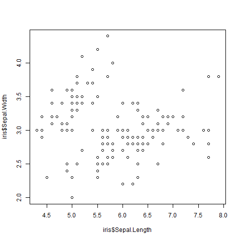

---
output:
  xaringan::moon_reader:
    css: ["./css/guu-slides-theme.css"]
    seal: false
    nature:
      ratio: '16:9'
      countIncrementalSlides: false
---

```{r setup, include=FALSE}
options(htmltools.dir.version = FALSE)

library('icons')

```

class: inverse, center, middle  
background-image: url(./images/title_GERB-GUU_16-9.png)
background-size: cover

## Обработка данных в среде офисных приложений: введение в R  

### Светлана Андреевна Суязова (Аксюк) </br> [sa_aksyuk@guu.ru](mailto:sa_aksyuk@guu.ru)  

2 октября 2021

---

## Лекция 3

**Публикация отчётов из RStudio с помощью knitr**  

- Средства публикации отчётов и возможности пакета `knitr`   
- Язык разметки RMarkdown  

**Пример отчёта**  

**Промежуточный тест**

---

## Преимущества автоматической генерации отчётов   

`r icons::fontawesome("laptop-code")` код с расчётами и поясняющий текст в одном скрипте;  

--

`r icons::fontawesome("align-left")` в скрипте можно использовать шаблоны для оформления таблиц, настраивать отображение рисунков: требуется минимум усилий по ручному оформлению;    

--

`r icons::fontawesome("clipboard")` не будет ошибок, связанных с копированием результатов из аналитического пакета и вставкой их в текст отчёта;   

--

`r icons::fontawesome("save")` можно экспортировать отчёт в популярные форматы: .html, .docx, .pdf   

---

## Пакеты R для оформления отчётов и презентаций  

- Отчёты: **`knitr`**. [Примеры](https://yihui.org/knitr/demo/minimal/); [Сайт проекта](https://github.com/yihui/knitr)   

- Слайды на HTML5 с широкими возможностями для настройки оформления: **`xaringan`**. [Примеры](https://slides.yihui.org/xaringan); [Сайт проекта](https://github.com/yihui/xaringan).   

- Слайды с интерактивными вопросами: **`slidify`**. [Примеры](https://rpubs.com/miguelpatricio/slidify); [сайт проекта](https://github.com/ramnathv/slidify).   

- Веб-страницы с динамическими графиками: **`shiny`**. [Примеры](https://shiny.rstudio.com/gallery/); [Сайт проекта](https://shiny.rstudio.com/)   

---

## Как работать с `knitr`  

- В RStudio создаём скрипт в формате `.Rmd` (R Markdown), указываем формат экспорта файла (html, Word или pdf)   

- Скрипт содержит: YAML-заголовок (можно не менять автоматический), текст с Markdown-разметкой, блоки кода на R.   

- Жмём кнопку , чтобы "связать" результат   

---

**Минимальный YAML-заголовок (Word):**  

````r
---  
title: "Отчёт по лабораторной работе"
output: word_document
---
````
Дополнительные теги:  

````r
author: И.И.Иванов ivanushka@bk.ru
date: '` r format(Sys.time(), "%d %B, %Y")`'
output:
  word_document:
    reference_docx: word-styles.docx
    toc: true
    toc_depth: 2
````

---

**Разметка на R Markdown**

````
# Заголовок 1 уровня 
## Заголовок 2 уровня
### Заголовок 3 уровня
````

# Заголовок 1 уровня 
## Заголовок 2 уровня
### Заголовок 3 уровня

---

**Разметка на R Markdown**

````
**Полужирный шрифт**
*Курсив*
`Моноширинный шрифт`
$E = m \cdot c^2$  
<https://guu.ru/>  
[Wiki](https://www.wikipedia.org/)
````

**Полужирный шрифт**   
*Курсив*   
`Моноширинный шрифт`  
$E = m \cdot c^2$   
<https://guu.ru/>   
[Wiki](https://www.wikipedia.org/)  

---

**Разметка на R Markdown**

````
Последовательность действий:  
1. Загрузить данные  
1. Провести предварительный анализ:  
- рассчитать описательные статистики
- построить графики разброса
- оценить корреляцию  
````

Последовательность действий:   
1. Загрузить данные   
1. Провести предварительный анализ    
- рассчитать описательные статистики  
- построить графики разброса  
- оценить корреляцию  

---

**Блоки кода**

````r
```{ r}
head(iris[, 1:4])
```
````

```{r, echo=F}
head(iris[, 1:4])
```

---

.small[
````r
```{ r}
plot(iris$Sepal.Length, iris$Sepal.Width)
```
````
]

```{r, echo=F}
png('./slides_lection_03_files/plot.png')
plot(iris$Sepal.Length, iris$Sepal.Width)
whatever <- dev.off()
```



---

.small[
Подробнее об RMarkdown: 

- Глава "Представление данных: rmarkdown" / *Г.А.Мороз*, *И.С.Поздняков* Наука о данных в R для программы Цифровых гуманитарных исследований. URL: <https://agricolamz.github.io/DS_for_DH/data-presentation.html>   

Практика с примером оформления отчёта:  

- посмотрим на шаблон отчёта в формате .Rmd в RStudio   

- создадим короткий отчёт по мотивам предыдущих лабораторных работ   
]

.center[

<font size = "3px">image credit: krman009@github.com</font>
]
